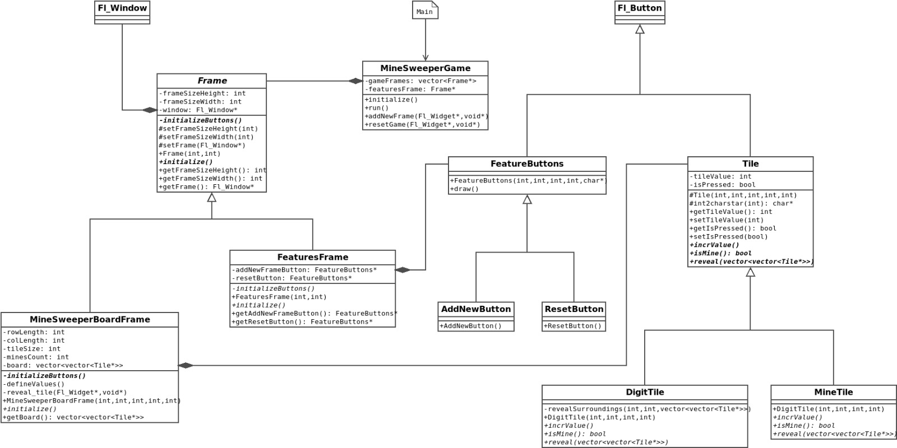

# Interactive Minesweeper Game

## Overview

This project is an interactive Minesweeper game developed in C++ using the **FLTK** (Fast Light Toolkit) library. The main focus of this game is to identify and apply various Object-Oriented Design Patterns in the design and implementation of the game. The game includes features such as resetting the game and creating new game panels while allowing the player to continue playing in the existing ones.

Below is the design diagram for the application.

## Features

- **Game Reset**: Allows the user to reset the current game to its initial state, clearing the board and redistributing the mines.
- **Multiple Game Panels**: Users can create new game panels while continuing to play on older ones, allowing for multiple games to be active simultaneously.

## Design Patterns Implemented

### 1. **Model-View-Controller (MVC)**
   - **Model**: Represents the game's logic, including the state of the mines, cells, and game status (win/lose).
   - **View**: Handles the graphical representation of the game board, using the FLTK library to draw the grid and cells.
   - **Controller**: Manages user input (such as clicking cells) and updates the Model accordingly.

### 2. **Observer Pattern**
   - The game board (subject) notifies the view (observers) of any changes in the game state, ensuring that the UI updates correctly in response to user actions.

### 3. **Factory Pattern**
   - A Factory class is used to generate different components of the game, such as the game panel, cells, and buttons, ensuring consistent creation and reducing code duplication.

### 4. **Singleton Pattern**
   - A Singleton is used for managing the global game settings and resources, such as the number of rows, columns, and mines, ensuring that these resources are consistent across different game panels.
   
## Installation and Setup

### Prerequisites
- **C++ Compiler**: Ensure you have a C++ compiler installed (e.g., g++, clang).
- **FLTK Library**: Install the FLTK library on your system.

### Compilation and Running the Game
To compile the Minesweeper game, use the following steps in the terminal:
1. Open-up the terminal, go into `src` folder and run command `make`.
2. Now start the game using `./main`.
